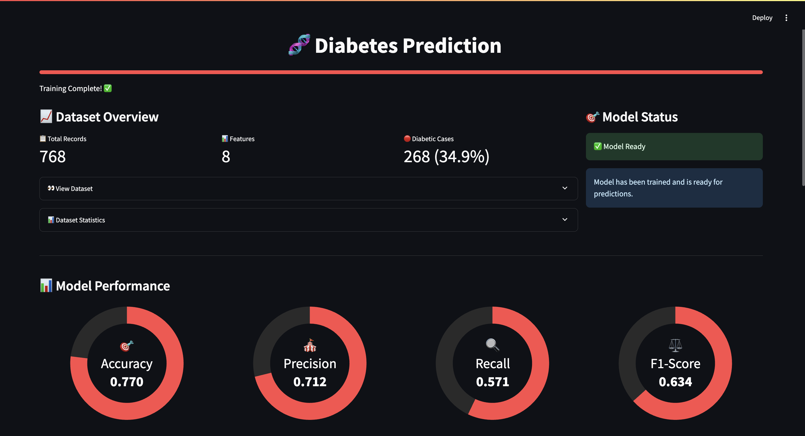
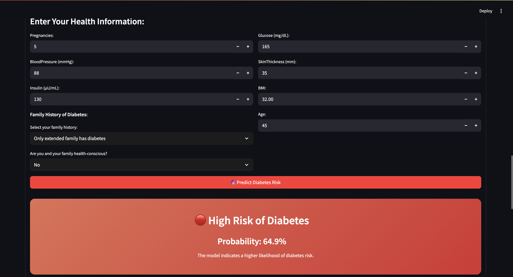
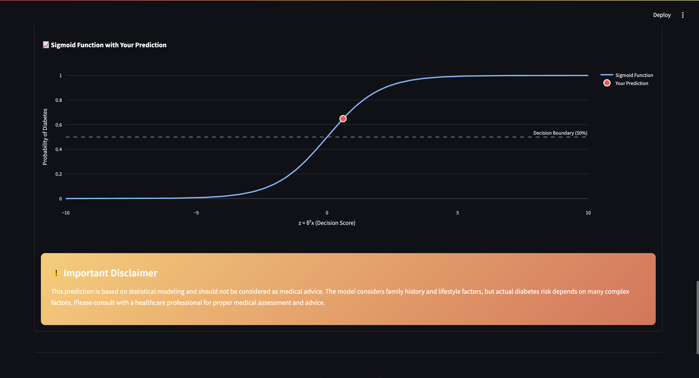
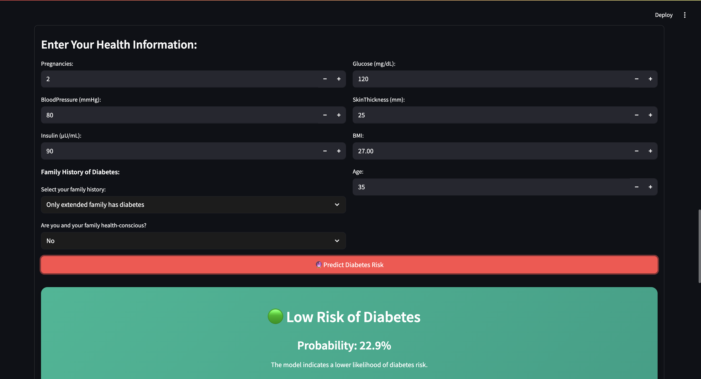
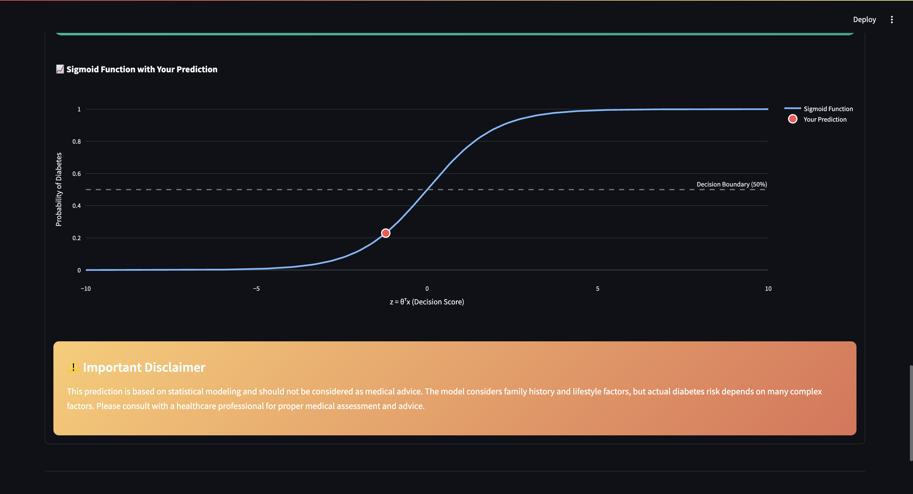

# 🧬 Diabetes Prediction App using Manual Logistic Regression

<p align="center">
  
  
  
</p>

<div align="center">
  
</div>

---

## 📌 About the Project

This project is a minimalistic yet powerful web app that predicts the likelihood of diabetes using a **manually implemented Logistic Regression algorithm** 🔥

Built from scratch with **NumPy**, **matplotlib**, and deployed beautifully using **Streamlit**, this project is ideal for those who want to **understand the inner workings** of ML models — not just use libraries blindly.

---

## 💻 Features

✅ Predict diabetes based on user health input  
✅ Clean & aesthetic UI (no sliders!)  
✅ Cost Function & Training Accuracy Visualizations  
✅ Manual Logistic Regression implementation  
✅ Works 100% without scikit-learn  
✅ Fully interactive and beginner-friendly  

---

## 📊 Inputs Used
**NOTE** : Diabetes Pedigree Function is adjusted in the Family History and Health Consciousness.
- **Pregnancies**
- **Glucose Level**
- **Blood Pressure**
- **Skin Thickness**
- **Insulin Level**
- **BMI**
- **Age**
- **Family History of Diabetes**
- **Health Consciousness**

---

## 🚀 How to Run Locally

```bash
# Step 0: 
cd Desktop

# Step 1: Clone the repo
git clone https://github.com/crused_0men/diabetes-prediction-streamlit.git

# Step 2: Navigate into it
cd diabetes-prediction-streamlit

# Step 3: Install dependencies
pip install -r requirements.txt

# Step 4: Run the app
streamlit run app.py
```

## 🧠 Model Logic
- Implemented gradient descent manually
- Calculated the log loss cost function
- Converted raw probability to predicted class using threshold
- Tracked training loss per iteration for plotting
- Binary classification (diabetic vs non-diabetic)

## 📁 Project Structure
```bash
Diabetes-Prediction/
│
├── diabetes.csv
├── Diabetes_Prediction.ipynb (Logistic Regression Model)
├── app.py                    (Streamlit front-end)
├── requirements.txt
├── images/
│   ├── demo_ss.png 
│   ├── diabetic1.png
│   ├── diabetic1-1.png
│   ├── non-diabetic1.png
│   ├── non-diabetic1-1.png
│   └── train.png
└── README.md 
```
---

## 📸 Snapshots
### 🖼️ Diabetic




### 🖼️ Non-Diabetic



---
# TL;DR...click here😄 [https://diabetespredictionappml.streamlit.app/]

> Built with ❤️ using [Streamlit](https://streamlit.io)  
> Machine Learning | Author: [<u>Dhyey Savaliya</u>](https://www.linkedin.com/in/dhyey-savaliya-632bb4246/)
